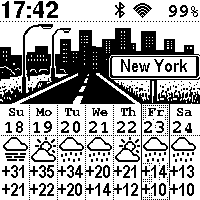
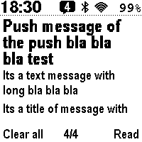
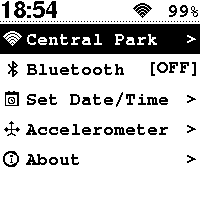
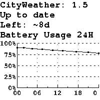

# CityWeather for Watchy

CityWeather is a compact weather-focused watch face for [SQFMI Watchy](https://watchy.sqfmi.com): current time, location-based weekly forecast, iOS push notifications, battery history, and a clean settings menu.

   

## Features

- Location-based forecast via Wi-Fi and Open-Meteo
- Current week calendar with weather icons and min/max temperature
- iOS push notifications over Bluetooth ANCS
- Status bar with time, battery, Wi-Fi, Bluetooth, and notification count
- Battery usage graph with estimated remaining runtime
- About screen with firmware version and cached update status
- Web installer for quick flashing from Chrome or Edge
- USB Serial screenshot capture for previews and debugging

## Web Install

Open [CityWeather Web Installer](https://vsdyachkov.github.io/watchy-cityweather/) in desktop Chrome or Edge, connect Watchy over USB, and install.

Keep **Erase data** disabled to preserve Wi-Fi and local history.

## Manual Install

```sh
pio run -e watchy
pio run -e watchy -t upload
```

## Screenshots

Hold the Watchy Menu button and capture over USB Serial:

```sh
python3 tools/watchy_screenshot.py /dev/cu.usbserial-58910059051 screenshot.png
```

## Credits

- [SQFMI Watchy](https://github.com/sqfmi/Watchy) - watch SDK
- [Open-Meteo](https://open-meteo.com) - weather API
- [ipwho.is](https://ipwho.is) - geolocation API
- [ESP Web Tools](https://esphome.github.io/esp-web-tools/) - web flasher
- [ESP32-ANCS-Notifications](https://github.com/Smartphone-Companions/ESP32-ANCS-Notifications) - iOS push
- [PlatformIO](https://platformio.org) - build tools
- [Lopaka](https://lopaka.app) - UI editor
- [image2cpp](https://javl.github.io/image2cpp) - bitmap converter
- [truetype2gfx](https://rop.nl/truetype2gfx) - font converter
