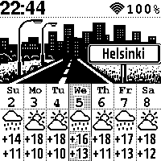

# watchy-cityweather
CityWeather - SQFMI Watchy SDK based watchface for Watchy displays schematic image and weather for the current week

Features:
- Geolocation by WiFi via https://ipwhois.io
- Synchronize date/time (NTP)
- Weather forecast via https://open-meteo.com
- No manual IDE settings or API keys are required

[Watchy](https://watchy.sqfmi.com) - Fully Open Source E-Paper Watch 

For install watchface you need [VSCode](https://code.visualstudio.com) + [PlatformIO](https://platformio.org)

Tools were used:

- https://watchy.sqfmi.com/docs/create-watchface - Watchy docs
- https://github.com/sqfmi/Watchy - SQFMI Watchy SDK
- https://lopaka.app - UI graphics editor for embedded screens
- https://javl.github.io/image2cpp - Image to byte array converter
- https://rop.nl/truetype2gfx - Standard font to Adafruit_GFX font converter
